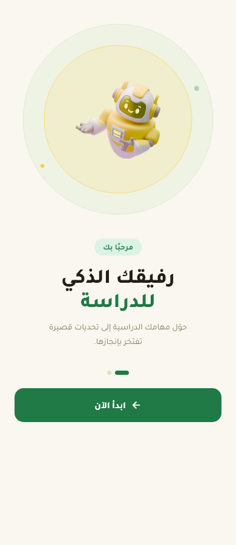
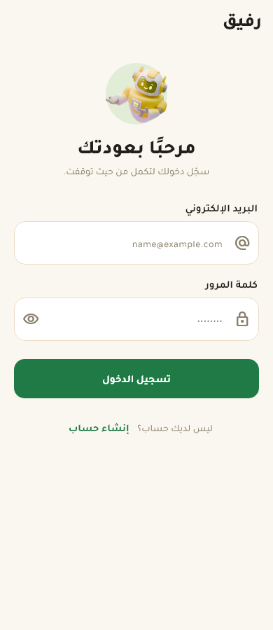
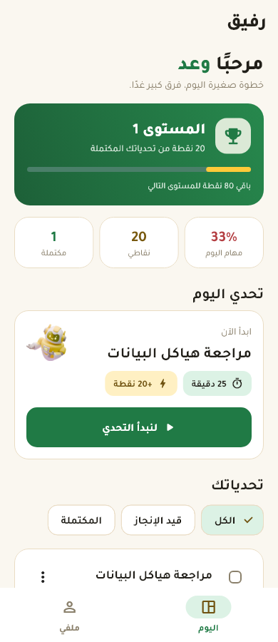
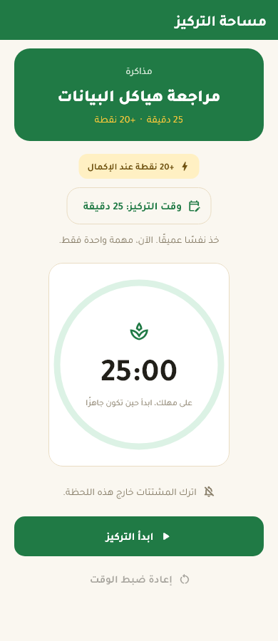
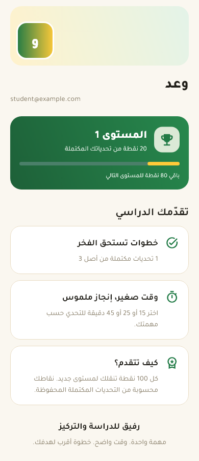

# رفيق

رفيق تطبيق Flutter للطلاب والطالبات يحوّل المهام الدراسية إلى تحديات قصيرة محددة بوقت. فكرته أن تكون البداية أسهل، وأن يظهر التقدّم بوضوح من خلال النقاط والمستويات بدل الاكتفاء بقائمة مهام تقليدية.

رابط المشروع: [Rafiq on GitHub](https://github.com/alamriwaad6-web/rafiq-app). يظهر أحدث إصدار بعد رفع التغييرات المحلية إلى المستودع.

## المشكلة والفئة المستهدفة

قد تؤدي المهام الدراسية الكبيرة وغير المحددة إلى التأجيل. يستهدف رفيق الطلاب والطالبات الذين يحتاجون إلى تقسيم المذاكرة والواجبات إلى خطوات صغيرة قابلة للإنجاز، مع مؤقّت يساعدهم على التركيز.

## أهم المزايا

- إنشاء تحدٍ بعنوان ووصف وتصنيف ومدة، ثم إكماله أو حذفه.
- جلسة تركيز يمكن للطالب تحديد مدتها من ١ إلى ١٨٠ دقيقة، مع إيقاف المؤقّت واستئنافه وإعادة ضبطه.
- نقاط ومستويات تُحسب من التحديات المكتملة، مع ملخص للتقدّم.
- تسجيل حساب والدخول بالبريد الإلكتروني وكلمة المرور باستخدام Firebase Authentication.
- حفظ التحديات محليًا على الجهاز واستعادتها عند إعادة فتح التطبيق.
- واجهة عربية باتجاه من اليمين إلى اليسار، مع تصميم يناسب أحجام شاشات مختلفة.

> ملاحظة: حساب المستخدم يُدار بواسطة Firebase Authentication، لكن التحديات حاليًا تُحفظ محليًا على الجهاز بواسطة Shared Preferences. لا توجد مزامنة للتحديات بين الأجهزة أو فصل لها بحسب الحساب، ولا تُستخدم Firestore في النسخة الحالية.

## التقنيات وتنظيم المشروع

- **Flutter / Dart:** بناء الواجهات والتنقل بين الشاشات.
- **flutter_bloc (Cubit):** إدارة حالة التحديات والتحميل والأخطاء.
- **Shared Preferences:** حفظ التحديات محليًا بعد تحويل نموذج `Task` إلى JSON.
- **Firebase Authentication:** إنشاء الحسابات وتسجيل الدخول.
- **Material 3 وخط Tajawal:** الهوية البصرية العربية ودعم RTL.
- **flutter_test:** اختبار النموذج والنماذج والواجهات والمؤقّت على أحجام مختلفة.

الملفات الأساسية مرتبة في `lib/screens` للشاشات، و`lib/widgets` للعناصر المشتركة، و`lib/cubit` للحالة، و`lib/models` للبيانات، و`lib/theme` للتصميم. يوجد كود تجريبي لعبارات يومية باستخدام Dio في `lib/repositories`، لكنه غير موصول بواجهة التطبيق الحالية ولا يُعد ميزة مفعّلة.

## طريقة التشغيل

النسخة الحالية مجهّزة للتشغيل على **Android**. إعدادات Firebase في `lib/firebase_options.dart` غير مهيأة للويب وiOS والمنصات المكتبية.

1. ثبّت Flutter وAndroid SDK، وشغّل محاكي Android أو صِل جهازًا.
2. تأكد من وجود إعداد Firebase الخاص بالتطبيق في `android/app/google-services.json` ومطابقته لمعرّف الحزمة في `android/app/build.gradle.kts`.
3. من مجلد المشروع شغّل:

```bash
flutter pub get
flutter run
```

للتحقق وبناء نسخة Android تجريبية:

```bash
flutter analyze
flutter test
flutter build apk --debug
```

لتجربة مسار المهام كاملًا، أنشئ حسابًا من داخل التطبيق، ثم أضف تحديًا وابدأ جلسة تركيز وأكملها.

## لقطات من التطبيق

هذه لقطات من اختبارات الواجهة ببيانات تجريبية؛ لا تمثل حساب مستخدم حقيقيًا.

| البداية | تسجيل الدخول | الرئيسية |
|---|---|---|
|  |  |  |

| التركيز | الملف |
|---|---|
|  |  |

## فيديو العرض

رابط فيديو الـDemo: **يُضاف بعد تسجيل تجربة فعلية للتطبيق**. تُوجد [خطة تصوير قصيرة](docs/demo-plan.md) تعرض الدخول، إضافة تحدٍ، اختيار وقت التركيز، إكمال المهمة، ثم ظهور النقاط والتقدّم.

## تحديات أثناء التطوير

- ظهرت مشكلة في تشغيل المحاكي وعرض التطبيق؛ تمت مراجعة إعدادات التشغيل وإعادة بناء نسخة Android وتثبيتها للتحقق من الواجهة الفعلية.
- احتاجت العربية وRTL إلى مراجعة اتجاه الواجهات والحقول؛ بقي البريد الإلكتروني والأرقام باتجاهها المعتاد حتى يسهل إدخالها وقراءتها.
- تداخلت عناصر رسم شاشة التعريف في البداية؛ أُعيد ترتيبها، ثم استُبدلت الصورة العلوية بخطوات دراسية واضحة.
- أُضيف تحقق صريح لحقول الدخول والتسجيل حتى تظهر أخطاء الإدخال قبل طلب Firebase.

## أدوات الذكاء الاصطناعي المستخدمة

استُخدم **Codex** للمساعدة في مراجعة الكود، تحسين الواجهات، كتابة الاختبارات والتوثيق. واستُخدم **Themely Design+Style Generator** لاستلهام اتجاه الألوان والتصميم. تمت مراجعة النتائج داخل المشروع واختبارها؛ لا يُعد استخدام هذه الأدوات بديلًا عن تجربة التطبيق يدويًا قبل التسليم.
